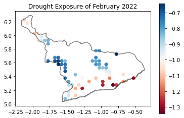
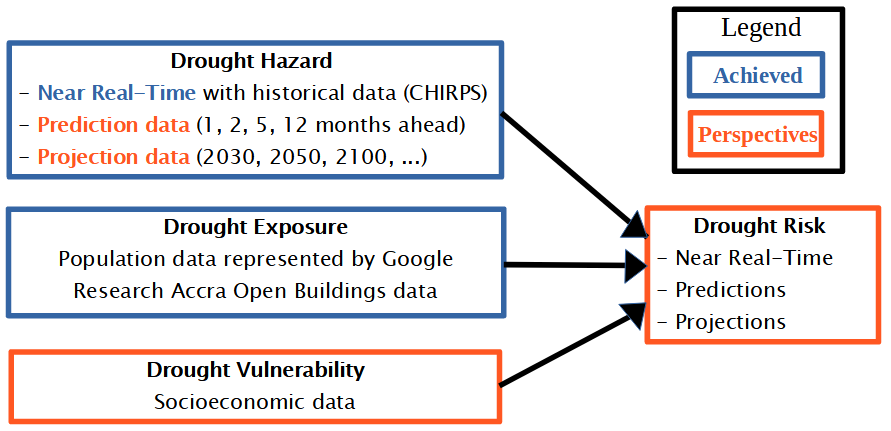

# near-real-time-drought-exposure

Near Real-Time Drought Exposure: Case Study of the Central Region, Ghana

Note: This document is the framework document for Hack the Continent Open Buildings Challenge organized by Google Research, Accra on the Zindi platform.

## Overview

In Africa, the frequency of natural disasters has substantially increased over the past four decades and at a faster pace than across the world (ie more than a third of the world’s droughts during 2010–2019 took place in Sub-Saharan Africa). Although droughts are less frequent compared to other natural hazards (floods, storms, ...), they had the largest human toll in terms of the number of people affected [1]. In the 2022 IPCC report, experts reaffirm that climate change is expected to dramatically increase the intensity and occurrence of extreme events in the Africa. A rise in drought occurrence would highly increase adverse impacts on water scarcity, crop production, infectious diseases, malnutrition and displacement [2]. 
Therefore, solutions to anticipate drought disasters become a priority in planning better humanitarian responses and executing disaster risk reduction programs efficiently. For this competition, the goal was to identify the latest locations particularly exposed to droughts using precipitation and building data. To achieve this goal: 
- buildings were clustered to group dense areas together,
- the Standardized Precipitation Index (SPI) was calculated and
- drought exposure locations were found.

 Ghana’s Central region was used as test area.

## Data

### Building Data
Open Buildings is a large-scale open dataset that contains the location of buildings in Africa derived from high-resolution satellite imagery. More than 500 million buildings were detected on 67% of the continent. This dataset is useful for a range of important applications, from population estimation, urban planning and humanitarian response to environmental and climate science. Source: [https://sites.research.google/open-buildings/](https://sites.research.google/open-buildings/)

### Rainfall Data
Climate Hazards Group InfraRed Precipitation with Station data (CHIRPS) is a 40+ year quasi-global rainfall data set. Spanning 50°S-50°N (and all longitudes) and ranging from 1981 to near-present, CHIRPS incorporates USGS’s and CHC’s in-house climatology, CHPclim, 0.05° resolution satellite imagery, and in-situ station data to create gridded rainfall time series for trend analysis and seasonal drought monitoring. Source: [https://www.chc.ucsb.edu/data/chirps](https://www.chc.ucsb.edu/data/chirps)

### Administrative boundary
Country outlines and administrative subdivisions for all countries. The level of subdivision varies between countries. Source: [http://diva-gis.org/gdata](http://diva-gis.org/gdata)

## Notebook Details

- [Clip building data](1_clip_building_data.ipynb): clips Open Buildings in Ghana’s Central region.
- [Clip rainfall data](2_clip_rainfall_data.ipynb): clips CHIRPS in Ghana.
- [Calculate clustered building's SPI](3_building_spi.ipynb): clusters buildings of Central region, calculates Ghana’s 1 month SPI and finds latest drought exposure locations

Table: Details on used notebooks

| Notebook name | Notebook environment | Notebook run time |
| --- | --- | --- |
| 1_clip_building_data.ipynb | Google Colab | 20 min |
| 2_clip_rainfall_data.ipynb | Google Colab | 5 min |
| 3_building_spi.ipynb | Local Machine | 2 min |

## Local machine Requirements

Install local environment using an Anaconda Prompt:

```
conda env create pyaj/GIS
```

Or download environment requirements [here](https://anaconda.org/Pyaj/GIS/2022.03.24.074655/download/GIS.yml)

## Why SPI

The Standard Precipitation Index (SPI) is a relatively new drought index based only on precipitation. It's an index based on the probability of precipitation for any time scale. In 2009, WMO recommended SPI as the main meteorological drought index that countries should use to monitor and follow drought conditions [3]. By identifying SPI as an index for broad use, WMO provided direction for countries trying to establish a level of drought early warning. SPI has an intensity scale in which both positive and negative values are calculated, which correlate directly to wet and dry events. For drought, there is great interest in the ‘tails’ of the precipitation distribution, and especially in the extreme dry events, which are the events considered to be rare based upon the climate of the region being investigated.

## Result

The final output of the project is a map showing the most sensible drought exposure locations in the later month. In February 2022, the southern regions were the most exposed areas in Ghana’s Central region.



## Perspectives

Socioeconomic data could have been added to the drought exposure map to obtain a drought risk map. Predictions and projections could also be made using rainfall forecast data to better anticipate future droughts.

This work has the potential to be applied in any African country where Google Accra has derived building data and therefore could significantly improve drought monitoring on the continent.



## Reference

	[1] Zeufack, Albert G.; Calderon, Cesar; Kubota, Megumi; Korman, Vijdan; Cantu Canales, Catalina; Kabundi, Alain N. 2021. “Africa’s Pulse, No. 24” (October), World Bank, Washington, DC. Doi: 10.1596/978-1-4648-1805-9.
	[2] IPCC, 2022: Summary for Policymakers [H.-O. Pörtner, D.C. Roberts, E.S. Poloczanska, K. Mintenbeck, M. Tignor, A. Alegría, M. Craig, S. Langsdorf, S. Löschke, V. Möller, A. Okem (eds.)]. In: Climate Change 2022: Impacts, Adaptation, and Vulnerability. Contribution of Working Group II to the Sixth Assessment Report of the Intergovernmental Panel on Climate Change [H.-O. Pörtner, D.C. Roberts, M. Tignor, E.S. Poloczanska, K. Mintenbeck, A. Alegría, M. Craig, S. Langsdorf, S. Löschke, V. Möller, A. Okem, B. Rama (eds.)]. Cambridge University Press. In Press.
	[3] Hayes, M., Svoboda, M., Wall, N., & Widhalm, M. (2011). THE LINCOLN DECLARATION ON DROUGHT INDICES: Universal Meteorological Drought Index Recommended. Bulletin of the American Meteorological Society, 92(4), 485–488. http://www.jstor.org/stable/26226865
